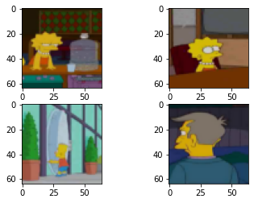
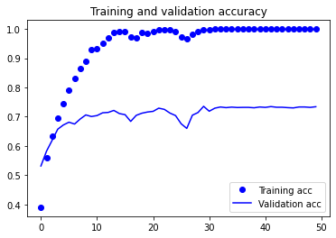
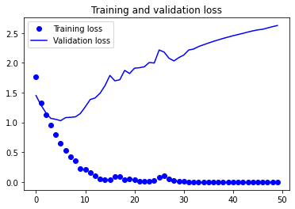
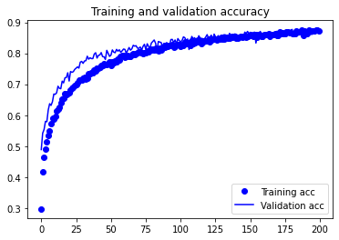
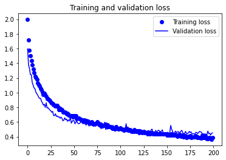

# Data Augmentation

In this repo, I use modified LeNet architecture to build classification model for `simpsons dataset`. 

    

The model is trained separately on two different datasets:
- The original one.
- The extended one using data augmentation technique.

Training the model using the original dataset led to overfitting, since the model has huge number of trainable parameters.

    
    

Using the augmented datasets, more robust model with impressive results were achieved.

    
    

